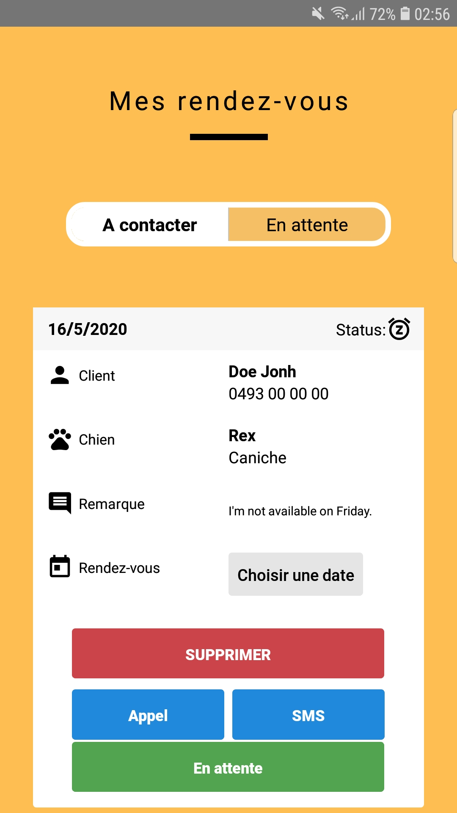
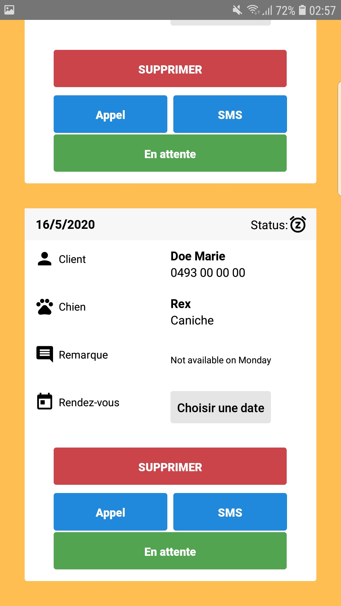
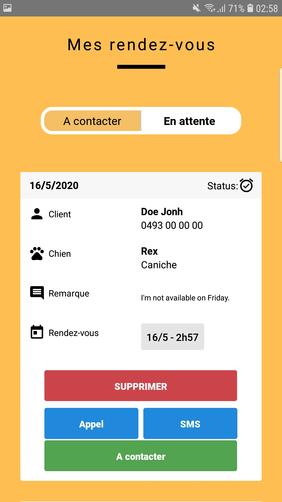
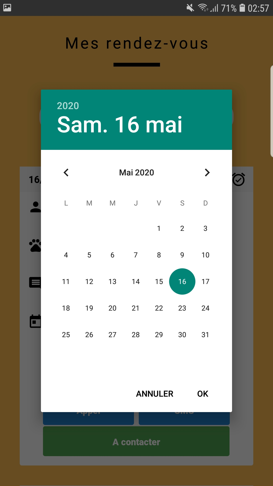
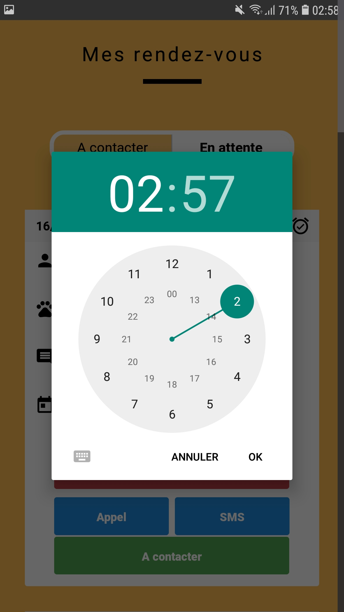
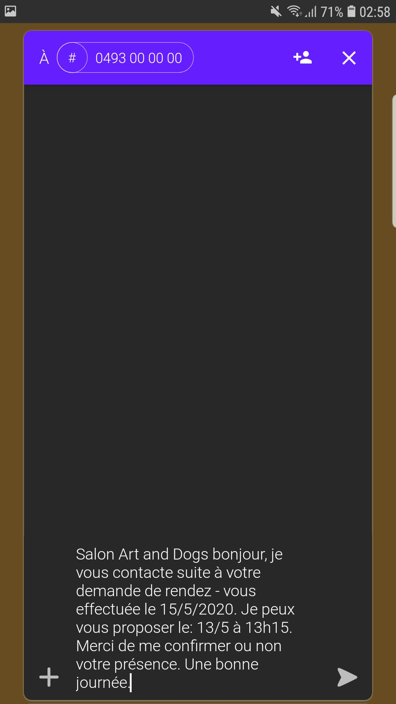

# Art and Dogs appointment manager mobile

## What
This is a mobile app that provide a dashboard to manage appointments took on the groomer's website.

## Features
- Real-time receiving and updating appointments. ✅
- Defining a appointment proposal date and time with android's calendar and clock. ✅
- Appointment status management. *(`to-do` or `waiting` answer from the customer)* ✅
- Appointment status icon. ✅
- Button to send auto-formatted SMS that include the date and time proposal. ✅
- Button to call the customer. ✅
- Button to delete an appointment. ✅
- Button to switch the appointment's status. ✅
- Switcher to filter appointments based on their status. ✅
- Push notification when new appointments. ❌ *(to-do)*

## Why
To help the groomer to manage appointments easily.

## Technos
It use `React Native` for the mobile ap and Google `Firebase` (firestore) as a database/server.

React native app created with `expo`.

## Screenshots

### To-do view

### Waiting view

### Calendar date picker

### Clock time picker

### SMS auto-formatted tool

## Who?
- Maxim Berge - Code
- Cassandra Caestecker - design

## Deployment
To create an APK installer for android, follow these steps:
- At your project's root type: `$ expo publish`
- Then go in the `android/` folder and type: `$ ./gradlew assembleRelease`
You will find the APK in `android/app/build/outputs/apk/release/app-release.apk`

## Remarques:
To set-up the firebase firestore (database like), you need to add a `google-services.json` file at this path of the repo:
`/android/app/google-services.json`

You can find this file in your firebase account.